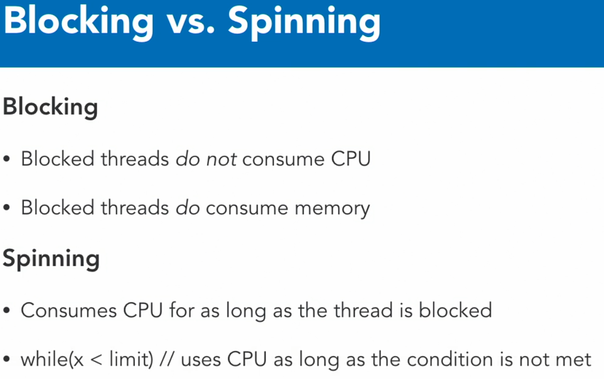

# THREAD COURSE
Reviewing following course: https://www.linkedin.com/learning/threading-in-c-sharp/understanding-threading

# IMPORTANT CONCEPTS FROM BASIC

## Task Continuation
* https://www.linkedin.com/learning/threading-in-c-sharp/tasks-with-continuation?contextUrn=urn%3Ali%3AlearningCollection%3A6912395370144673792&resume=false&u=2166394
* https://www.csharptutorial.net/csharp-concurrency/csharp-continuewith/

## Task Cancellation
* https://learn.microsoft.com/en-us/dotnet/standard/parallel-programming/task-cancellation
* https://medium.com/@luisalexandre.rodrigues/c-asynchronous-programming-cancel-your-tasks-when-you-no-longer-need-them-c57fbc59a514
* https://dotnettutorials.net/lesson/how-to-cancel-a-task-in-csharp/

# ADVANCED COURSE
Course: https://www.linkedin.com/learning/advanced-threading-in-c-sharp
Important topics:

## Thread Safety
Static properties methods thread safe? https://www.linkedin.com/learning/advanced-threading-in-c-sharp/thread-safety?autoSkip=true&resume=false&u=2166394
* `DateTime.Now` is example of thread safe
* When create a static make, better if they are thread safe

## Thread Affinity


Special methods that allows to access to some resource. e.g.: In WPF use of Dispatcher to update UI. But user doesn't require a lock over UI
```csharp
// txtMessage.Text = "Update value content"; // FAILS, it is not in dispachter context
Dispatcher.Invoke(() => txtMessage.Text = "Update value content";); // WORKS
```

## One Way Signaling
Way to block a process indefinetely until we call manually an event.

## Manual reset event
To have more control in which moment we need to block the event
