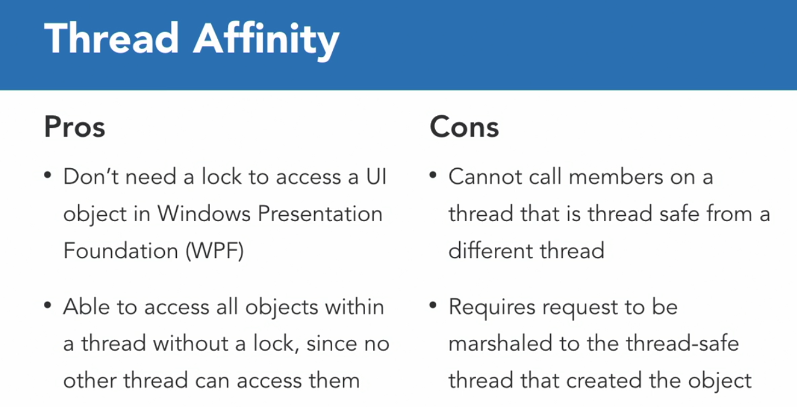

# THREAD COURSE
Reviewing following course: https://www.linkedin.com/learning/threading-in-c-sharp/understanding-threading
# ADVANCED COURSE
Course: https://www.linkedin.com/learning/advanced-threading-in-c-sharp
Important topics:

## Thread Safety
Static properties methods thread safe? https://www.linkedin.com/learning/advanced-threading-in-c-sharp/thread-safety?autoSkip=true&resume=false&u=2166394
* `DateTime.Now` is example of thread safe
* When create a static make, better if they are thread safe

## Thread Affinity

